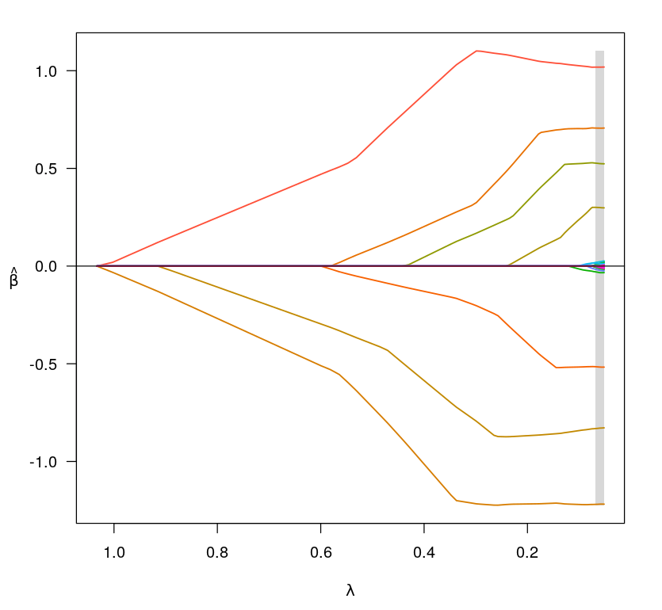
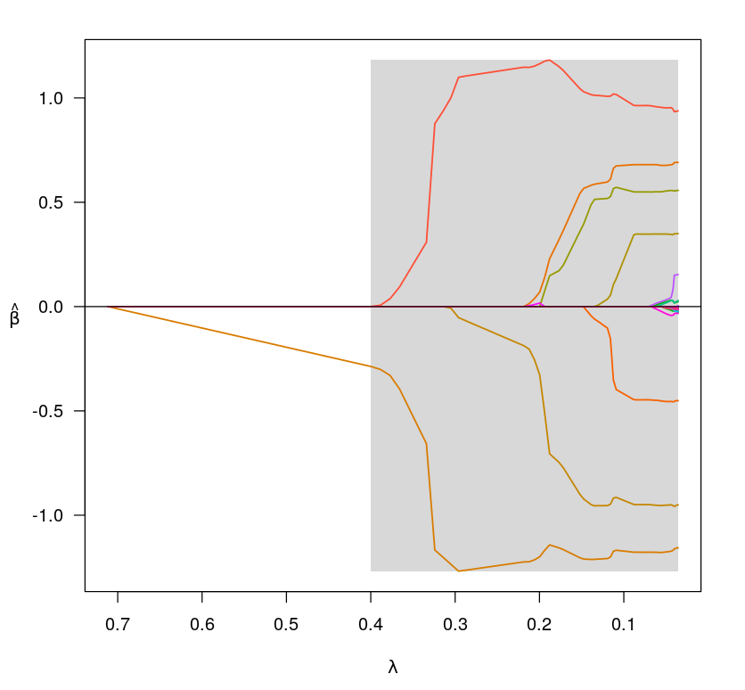

# LASSO_vs_SCAD
This is the numerical study to compare LASSO and SCAD in terms of model selection and prediction accuracy performance.
## SCAD path for independent dataset

## SCAD path for mutually dependent dataset

